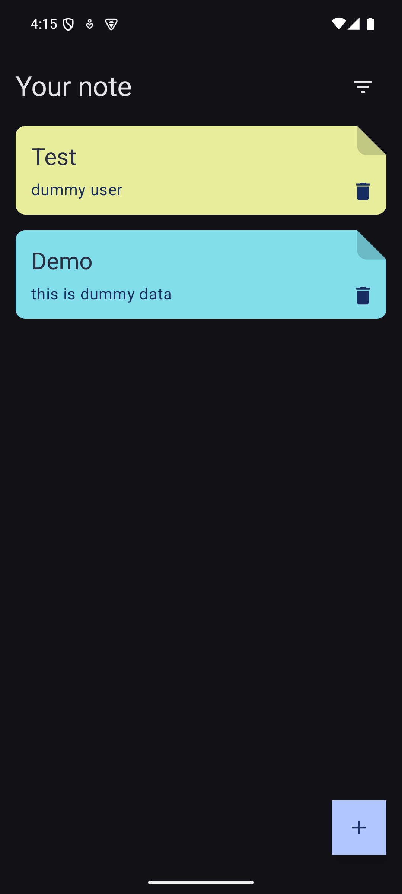
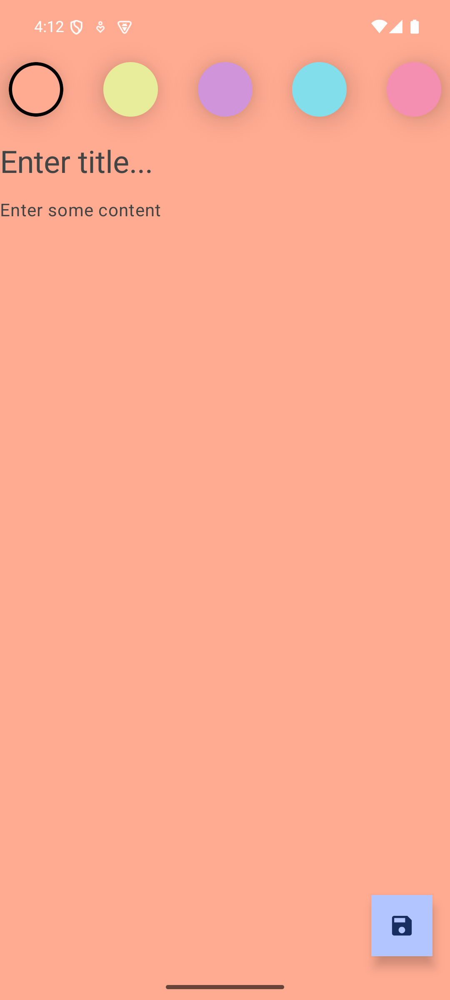

# NoteApp--MVVM-CRUD-Jetpack-Compose
The Clean Architecture is a software design pattern that separates the business logic from the presentation layer.

## 🌳 Environment
Android Studio version used : ``Android Studio Ladybug | 2024.2.2 Patch 3``

A clean architecture approach  using Jetpack compose, Kotlin, Navigation, MVVM, Hilt, Kotlin Coroutines, Flow and RoomDatabase.

## 🖼️ OutPut Screens

| List Screen   | Edit Screen   | 
|---------------|---------------|
|  |  |

